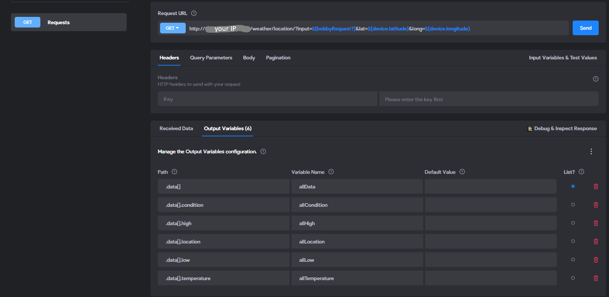
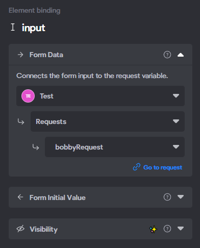
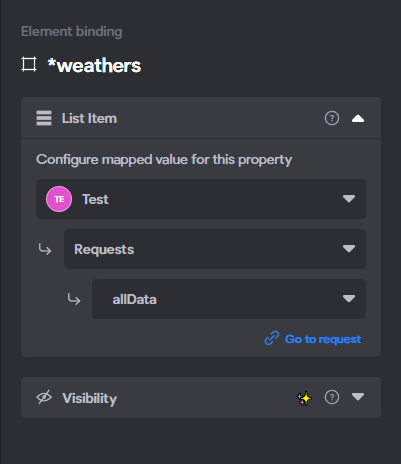
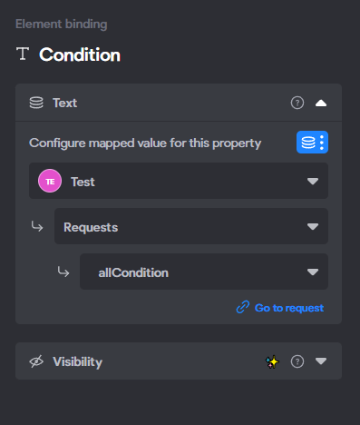

# Bravo-WeatherApp
Probably one of my most disliked projects, so this is not getting any improvements.

App does load and does work.

Project on figma:

[Figma](https://www.figma.com/design/tssjT2gqnVWlsGoVLfPebI/Weather-app?node-id=13-2&t=vJgD1XTeoB6iGHDM-1)

A little .gif file of the app:

Project screenshots on Bravo Studio:

Element bindings:

