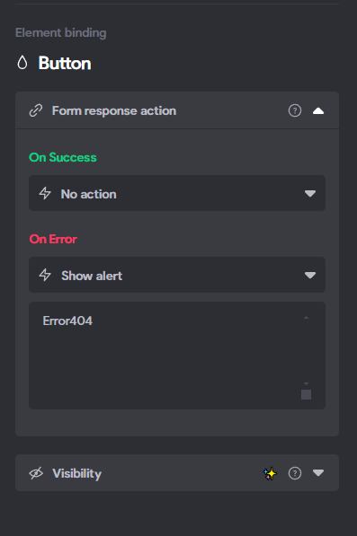

# Bravo-WeatherApp

Task was to create a WeatherApp using Figma and Bravo Studio. Adding a backend was optional but provided additional points. To test the app with the frontend, you need to clone my Figma project, import it into Bravo Studio, and include the information seen in the screenshots below.

Currently, the app runs exclusively through Bravo Studio's app environment, as generating an .apk file or using POST requests requires a paid subscription. Therefore, all functionality operates using GET requests only.

## Project Overview

Probably one of my least favorite projects, so no further improvements are planned.

### App Functionality

The application does load and function correctly. Certain sections of the GIF have been blurred to protect sensitive information (no full address reveal).

### Project Links and Resources

- **Figma Design:** [Weather-app on Figma](https://www.figma.com/design/tssjT2gqnVWlsGoVLfPebI/Weather-app?node-id=13-2&t=vJgD1XTeoB6iGHDM-1)

### App Preview

### Screenshots from Bravo Studio

- GET Request Example:
  

- Element Bindings:
  - Input:
    
  - Button:
    
  - Weather Containers:
    
  - Condition Binding Example:
    
